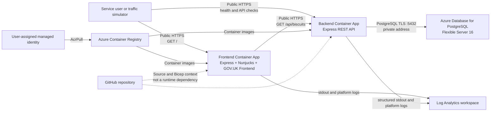
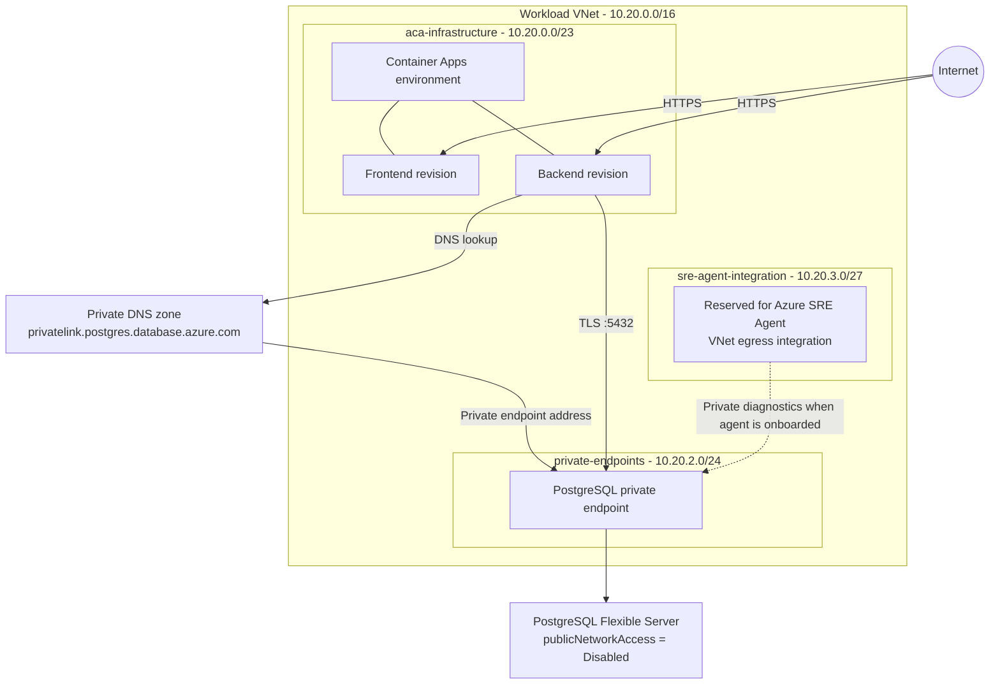
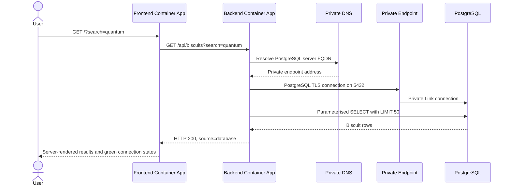

# Government Biscuit Location Service: system architecture

## Purpose

This document gives Azure SRE Agent the structural context required to
investigate the Government Biscuit Location Service. It describes the deployed
Azure resources, application request path, network boundaries, data model and
security assumptions.

The healthy baseline described here was checked on 17 September 2026. Resource
names are generated from the Azure Developer CLI environment, so deployments of
a fork can use different names.

## Service overview

The service is a humorous mock GOV.UK application that lets users search for
biscuits held in fictional government offices. Its serious purpose is to
provide clear, independently diagnosable frontend, API and database failure
boundaries for an Azure SRE Agent demonstration.

The workload is deployed in:

| Property | Current demo value |
|---|---|
| Azure region | Sweden Central |
| Resource group | `rg-saug-sre-agent-se` |
| Repository | `lestermarch/saug-sre-agent` |
| Deployment system | Azure Developer CLI with Bicep and remote container builds |
| Primary tag | `purpose=azure-sre-agent-demo-target` |

## Logical architecture

The frontend-to-backend call uses the backend's public Container Apps HTTPS
endpoint. The backend-to-PostgreSQL call is the private-network portion of the
application.

## Azure network topology

### Subnet purposes

| Subnet | Prefix | Configuration | Purpose |
|---|---|---|---|
| `aca-infrastructure` | `10.20.0.0/23` | Delegated to `Microsoft.App/environments` | Container Apps environment infrastructure |
| `private-endpoints` | `10.20.2.0/24` | Private endpoint network policies disabled | PostgreSQL Private Link network interface |
| `sre-agent-integration` | `10.20.3.0/27` | Delegated to `Microsoft.App/environments` | Dedicated Azure SRE Agent VNet integration |

The SRE Agent subnet must remain dedicated. It is not a PostgreSQL subnet and
must not host application resources.

## Search request sequence

The frontend renders on the server. JavaScript is progressive enhancement and
is not required for the search path.

## Application components

### Frontend

| Property | Design |
|---|---|
| Runtime | Node.js 20, Express, Nunjucks |
| User interface | Locally served GOV.UK Frontend assets |
| Container port | `8080` |
| Backend setting | `BACKEND_URL` points to the backend HTTPS FQDN |
| Ingress | Public, HTTPS only |
| Revisions | Single active revision |
| Scale | Minimum 1, maximum 3 replicas |
| Liveness | `GET /health/live` |
| Readiness | `GET /health/ready` |

Frontend liveness and readiness only prove that the frontend process can serve
requests. They do not prove backend or database availability.

The root page calls the biscuit API with a five-second timeout. It deliberately
continues to return an HTTP 200 page when the API or database is unavailable so
the user can see which downstream connection failed.

### Backend API

| Property | Design |
|---|---|
| Runtime | Node.js 20, Express, `pg` connection pool |
| Container port | `8080` |
| Database setting | `DATABASE_URL` from a Container Apps secret |
| Ingress | Public, HTTPS only, to make API health visible during demos |
| Revisions | Single active revision |
| Scale | Minimum 1, maximum 3 replicas |
| Connection pool | Maximum 5 connections, 5-second connection timeout |
| Liveness | `GET /health/live` |
| Readiness | `GET /health/ready`, including `SELECT 1` |

The backend logs one structured JSON record for every completed HTTP request.
Database readiness and query exceptions are logged as structured error events.

### PostgreSQL

| Property | Design |
|---|---|
| Service | Azure Database for PostgreSQL Flexible Server |
| Version | 16 |
| SKU | Burstable `Standard_B1ms` |
| Storage | 32 GB with autogrow |
| Backup | 7-day retention, no geo-redundant backup |
| High availability | Disabled for the inexpensive demo baseline |
| Database | `publicservice` |
| Authentication | Password authentication for the application |
| Network | Public network access disabled; Private Link only |
| TLS | Required by the application connection string |

The application password is a secret and must never be copied into agent
knowledge, prompts, logs or incident notes.

On first successful use, the backend creates and seeds:

- `public.service_status`
- `public.biscuits`

The biscuit search uses PostgreSQL parameters rather than interpolated SQL and
returns no more than 50 rows.

## Supporting resources

| Resource | Role |
|---|---|
| Azure Container Registry | Stores frontend and backend images; admin and anonymous access disabled |
| User-assigned managed identity | Gives both Container Apps `AcrPull` without registry credentials |
| Container Apps environment | Hosts both apps and sends logs to Log Analytics |
| Log Analytics workspace | Receives Container Apps platform logs and application stdout/stderr |
| Private DNS zone | Resolves the PostgreSQL service name to its private endpoint |
| Private endpoint and DNS zone group | Provides the only application data path to PostgreSQL |

## Current generated resource names

These names identify the original deployment only. Prefer the resource type,
tag and resource-group relationships when operating a fork.

| Resource type | Current name |
|---|---|
| Frontend Container App | `sre-saug-sre-age-kebnnk-frontend` |
| Backend Container App | `sre-saug-sre-age-kebnnk-backend` |
| Container Apps environment | `sre-saug-sre-age-kebnnk-cae` |
| PostgreSQL Flexible Server | `sre-saug-sre-agent-se-kebnnkaxdvuaq-pg` |
| PostgreSQL private endpoint | `sre-saug-sre-age-kebnnk-postgres-pe` |
| Virtual network | `sre-saug-sre-age-kebnnk-vnet` |
| Log Analytics workspace | `sre-saug-sre-age-kebnnk-law` |
| Managed identity | `sre-saug-sre-age-kebnnk-apps-id` |
| Container Registry | `sresaugsreagentsekebnnkaxdvuaq` |

## Security and availability assumptions

- PostgreSQL public access being disabled is the required healthy state, not an
  incident.
- Both application endpoints are public by design for demo visibility.
- Image pulls must use the managed identity and `AcrPull`.
- HTTPS-only ingress must remain enabled.
- Minimum replicas are one to reduce cold-start noise during demonstrations.
- The environment is single-region and intentionally has no database high
  availability or disaster-recovery design.
- There is no user authentication because the site contains only fictional
  demonstration data.
- Azure SRE Agent is onboarded separately and is not provisioned by this
  repository.
- GitHub Actions delivery is a planned demonstration capability, not part of
  the current deployed baseline.
