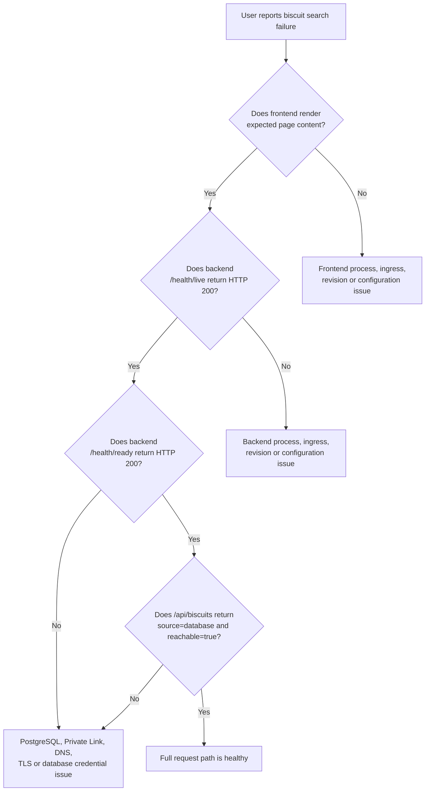
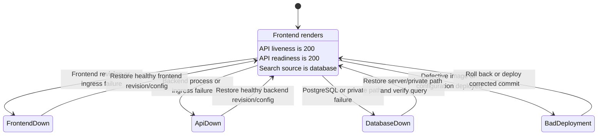
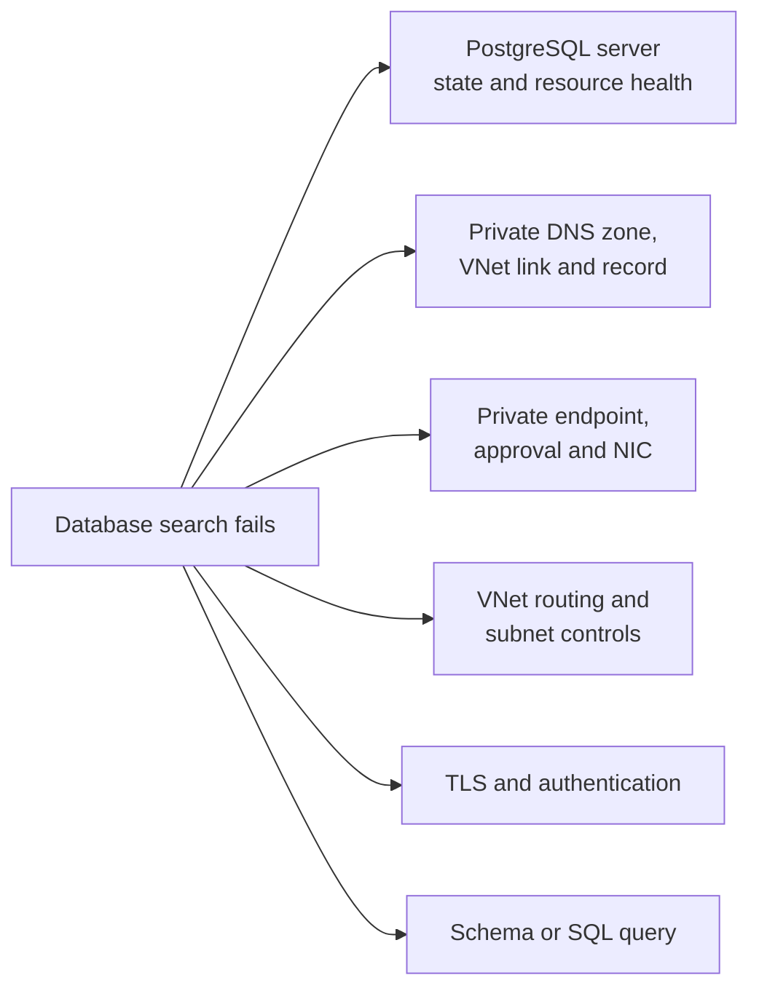

# Government Biscuit Location Service: signals and failure model

## Purpose

This document explains how to decide whether the frontend, API and PostgreSQL
dependency are healthy. It defines the expected endpoint semantics, logs,
failure evidence and alert-routing vocabulary for Azure SRE Agent.

## Reliability model

The application intentionally exposes three separate checks:

1. **Frontend render** - can the public web application return the expected
   service page?
2. **API liveness** - can the backend process respond independently of its
   database?
3. **Database search** - can the backend resolve, connect to and query
   PostgreSQL through Private Link?

A failure in a downstream component does not necessarily make every upstream
HTTP endpoint fail. This is deliberate and is the most important diagnostic
principle in the system.



## Endpoint contract

### Frontend

| Endpoint | Healthy response | Dependency semantics |
|---|---|---|
| `GET /` | HTTP 200 containing `Find biscuits in government offices` | Page can still be HTTP 200 when API or PostgreSQL is down; inspect the rendered connection states |
| `GET /health/live` | HTTP 200, `status=alive`, `service=frontend` | Frontend process only |
| `GET /health/ready` | HTTP 200, `status=ready`, `service=frontend` | Frontend process only; it does not call the API |

Frontend status labels:

| Label | Meaning |
|---|---|
| `API available` | Frontend received parseable application data from the backend |
| `API unavailable` | Backend request failed, timed out or returned an unexpected response |
| `Database reachable` | Backend reported a successful PostgreSQL query |
| `Database unavailable` | Backend was reachable but reported a database error |
| `Database status unknown` | API could not be reached, so the frontend cannot observe PostgreSQL |
| `Database not configured` | Local mock mode without `DATABASE_URL`; this is not the Azure baseline |

### Backend

| Endpoint | Healthy response | Failure response |
|---|---|---|
| `GET /health/live` | HTTP 200, `status=ok`, `service=backend` | No response or non-200 indicates backend process or platform failure |
| `GET /health/ready` | HTTP 200 after `SELECT 1` | HTTP 503 with `dependency=postgres` |
| `GET /api/status` | HTTP 200, `source=database`, `database.reachable=true` | HTTP 503, `source=database-error` |
| `GET /api/biscuits` | HTTP 200, `source=database`, `database.reachable=true` | HTTP 503, `source=database-error`, zero results |

Local development without a database returns `source=mock`. A deployed Azure
environment returning mock data is degraded and incorrectly configured.

## Full request-path state model



`BadDeployment` can manifest as any of the other observable states. Use revision
timestamps, image references and repository history to determine whether a
recent change is causal rather than assuming every application failure is a
platform problem.

## Application log contract

Backend request completion record:

```json
{
  "severity": "info",
  "service": "backend",
  "method": "GET",
  "path": "/api/biscuits",
  "statusCode": 200,
  "durationMs": 24
}
```

Database-specific error events:

| Event | Where emitted | Meaning |
|---|---|---|
| `postgres-readiness-failed` | `/health/ready` | `SELECT 1` failed |
| `postgres-query-failed` | `/api/status` | Status-table initialization or query failed |
| `biscuit-search-failed` | `/api/biscuits` | Biscuit table initialization or filtered query failed |

The error message can help classify DNS, timeout, TLS, authentication and SQL
failures, but it must not include or be augmented with credentials.

Frontend warning:

```text
Biscuit API unavailable: <reason>
```

The frontend warning proves that the frontend process was alive enough to
attempt the backend call.

## Failure classification matrix

| Observation | Likely boundary | First evidence to inspect |
|---|---|---|
| Frontend has no response | Frontend Container App | Revision state, replica events, ingress and frontend logs |
| Frontend health is good but page reports API unavailable | Backend/API | Backend liveness, active revision, replica/probe failures and logs |
| Backend liveness fails | Backend process or platform | Container startup, image, environment variables, probes and revision events |
| Backend liveness succeeds but readiness fails | PostgreSQL dependency | PostgreSQL state, private endpoint, DNS and backend database error |
| Search returns HTTP 503 with `database-error` | PostgreSQL dependency | Same as readiness, then query/authentication evidence |
| Search returns `source=mock` in Azure | Backend configuration | Missing or invalid `DATABASE_URL` secret reference |
| Only one search/filter fails | Application/query code | Request parameters, backend error event, recent code change |
| Failure begins immediately after deployment | Code or configuration | Revision creation time, image tag, GitHub commit and deployment history |
| PostgreSQL public access is disabled | Healthy security baseline | Do not change it |

## Database failure decomposition



Investigate these branches independently. Do not infer that PostgreSQL itself is
down merely because the API cannot connect.

## Traffic simulator

`scripts/Invoke-TrafficSimulator.ps1` generates user-like traffic and records
the externally observed outage duration.

| Simulator target | Healthy condition |
|---|---|
| Frontend | HTTP success and expected page content |
| API | `/health/live` returns `status=ok` |
| Database search | `/api/biscuits` returns `source=database` and `database.reachable=true` |

The simulator prints green `UP` and red `DOWN` records with timestamp, HTTP
response, latency and details. It measures recovery from the first observed
failure until the first subsequent successful check. Optional CSV output is
useful for comparing alert fire time, investigation start, remediation and
external recovery.

The simulator is an external observation. Its outage duration can differ from
Azure Monitor alert duration because of evaluation windows and polling
intervals.

## Alert naming and incident routing

Use alert-title prefixes to make Azure Monitor response-plan routing
deterministic:

| Prefix | Intended custom agent |
|---|---|
| `[DEMO][FRONTEND]` | General Azure Operator |
| `[DEMO][API]` | General Azure Operator |
| `[DEMO][CODE]` | General Azure Operator |
| `[DEMO][POSTGRES]` | PostgreSQL Specialist |

Do not create a broad catch-all response plan that overlaps the PostgreSQL
title filter. Delete the automatically created quickstart response plan before
enabling these specific plans.

## Recommended diagnostic order

1. Record alert title, severity, fire time and affected resource.
2. Check the external symptom using the three traffic-simulator boundaries.
3. Check Container Apps active revisions, replica status and probe events.
4. Query application and platform logs around the first failure.
5. Correlate the failure with revision and repository history.
6. For database symptoms, check PostgreSQL state, metrics, Private Link and
   private DNS before considering credentials or SQL.
7. State the evidence-supported root cause and the smallest reversible fix.
8. Verify all three external checks after remediation.

## Current observability limits

- Container Apps platform and application console logs are connected to Log
  Analytics.
- The workload does not currently provision Application Insights distributed
  tracing.
- The workload does not currently provision Azure Monitor alert rules.
- The code delivery workflow described by the demo story is not yet present in
  `.github/workflows`.

An agent must report these absent signals as unavailable rather than inventing
telemetry or assuming an alert/workflow exists.
