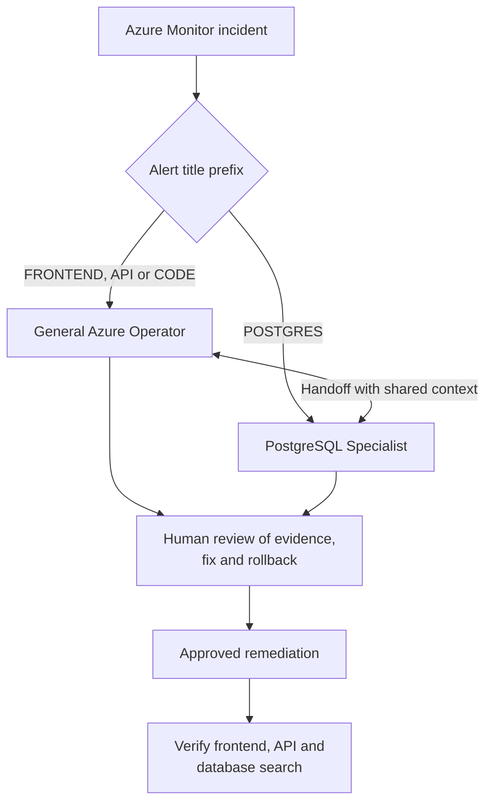
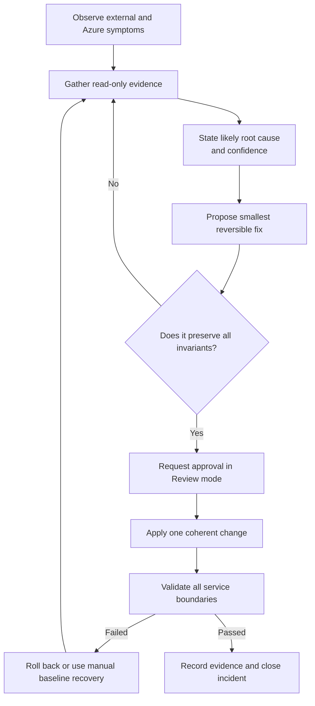

# Government Biscuit Location Service: operations and recovery

## Purpose

This document defines safe operating behavior for Azure SRE Agent. It provides
incident routing, investigation rules, remediation boundaries and verification
criteria for the frontend, API, PostgreSQL and code-change demonstration
scenarios.

## Operating objective

Restore the observable service with the smallest reversible change while
preserving the intended private PostgreSQL architecture and the known-good
Container Apps revisions.

The agent must diagnose before changing resources. During initial
demonstrations, all incident response plans run in **Review** mode and require
human approval before write actions.

## Agent routing



Use the PostgreSQL Specialist when the backend is alive but database readiness
or search is failing, or when evidence names PostgreSQL, Private Link, private
DNS, TLS or database authentication.

Use the General Azure Operator for frontend and backend process failures,
Container Apps revisions, application configuration, ingress, deployments and
GitHub-related incidents.

## Non-negotiable invariants

The following conditions must remain true during diagnosis and recovery:

- PostgreSQL public network access remains disabled.
- The backend reaches PostgreSQL through the approved private endpoint and
  `privatelink.postgres.database.azure.com`.
- No public PostgreSQL firewall exception is added.
- Database credentials are never printed, uploaded to knowledge, written to an
  issue or included in an incident summary.
- The PostgreSQL server, database, private endpoint, private DNS zone, VNet and
  known-good Container Apps revisions are not deleted.
- ACR admin and anonymous access remain disabled.
- Container image pulls continue to use the user-assigned managed identity.
- HTTPS-only ingress remains enabled.
- The agent does not merge directly to `main`.
- Write actions remain within the workload resource group except the expected
  Azure Monitor alert-lifecycle permission.
- Unrelated subscriptions, resource groups and shared infrastructure are out of
  scope.

## Investigation and action protocol



Every proposed action must include:

1. evidence supporting the diagnosis
2. exact resource and configuration to change
3. expected effect
4. risk and blast radius
5. rollback method
6. post-change verification

## Known-good validation

A recovery is complete only when:

| Boundary | Required result |
|---|---|
| Frontend | Root page returns HTTP 200 and contains the biscuit-search page |
| API | Backend `/health/live` returns HTTP 200 with `status=ok` |
| Database dependency | Backend `/health/ready` returns HTTP 200 |
| Full query path | `/api/biscuits` returns HTTP 200, `source=database`, `database.reachable=true` |
| User interface | API and database connection indicators are green |
| Platform | Both Container Apps have a running active revision and healthy replicas |
| Security | PostgreSQL public access remains disabled |
| Network | Private endpoint and private DNS integration remain healthy |

Do not close an incident after only the Azure resource state changes. Verify the
external application path and allow the traffic simulator to observe recovery.

## Runbook: frontend failure

### Trigger

- frontend URL has no response
- expected page content is missing
- frontend liveness fails
- `[DEMO][FRONTEND]` alert

### Read-only investigation

1. Inspect the frontend Container App provisioning and running state.
2. Identify the active revision and image.
3. Inspect replica startup, termination and probe events.
4. Query frontend logs around the first observed failure.
5. Check public ingress, target port `8080`, HTTPS-only configuration and
   traffic weight.
6. Compare the failing revision time with recent deployments or commits.
7. Check that `BACKEND_URL` exists, while remembering that a bad backend URL
   should degrade search rather than stop frontend liveness.

### Preferred recovery order

1. Restore a known-good frontend revision or configuration.
2. Correct an isolated ingress, environment-variable or probe regression.
3. Deploy a tested code correction when the defect is in source.

### Avoid

- changing PostgreSQL or private networking for a frontend process failure
- deleting the failing revision before evidence is captured
- replacing managed identity image pulls with registry credentials

## Runbook: backend/API failure

### Trigger

- backend `/health/live` has no response or is non-200
- frontend reports `API unavailable`
- `[DEMO][API]` alert

### Read-only investigation

1. Confirm whether backend liveness fails independently of database readiness.
2. Inspect backend active revision, image, replicas and probe failures.
3. Query startup and request logs.
4. Check ingress, port `8080`, HTTPS and traffic routing.
5. Confirm the `DATABASE_URL` secret reference exists without revealing its
   value.
6. Compare the revision with the most recent known-good revision and GitHub
   history.

### Preferred recovery order

1. Restore the last known-good backend revision or configuration.
2. Correct an isolated Container Apps setting or secret reference.
3. Deploy a tested code correction.

After recovery, verify both backend liveness and the database-backed biscuit
search. API recovery alone is not proof that PostgreSQL connectivity works.

## Runbook: PostgreSQL or private-network failure

### Trigger

- backend liveness succeeds but readiness returns HTTP 503
- `/api/biscuits` returns `source=database-error`
- frontend shows `API available` and `Database unavailable`
- `[DEMO][POSTGRES]` alert

### Read-only investigation

1. Confirm backend liveness separately from readiness.
2. Inspect PostgreSQL provisioning state, resource health and availability.
3. Review CPU, memory, storage, active connections, failed connections and
   maintenance signals.
4. Inspect the private endpoint provisioning state and connection approval.
5. Inspect the private endpoint network interface.
6. Verify the private DNS zone exists.
7. Verify the VNet link and private endpoint DNS zone group exist and are
   healthy.
8. Verify the PostgreSQL FQDN resolves to the expected private endpoint address
   from the VNet-integrated diagnostic environment.
9. Inspect ordered outbound rules on the Container Apps infrastructure NSG for
   the Container Apps subnet to the resolved private endpoint address on TCP
   5432. Record the matching rule's access, priority, source, destination and
   port; a lower priority number takes precedence.
10. Inspect backend errors and classify DNS, timeout, refused connection, TLS,
    authentication or SQL failure.
11. Use direct SQL only through an approved read-only psql tool and a dedicated
    diagnostic login.

### Preferred recovery order

Choose only the branch supported by evidence:

- resume or restore a PostgreSQL server that is unexpectedly unavailable
- restore an accidentally removed or invalid private DNS link or zone group
- correct a failed private endpoint approval or narrowly scoped network setting
  only after recording the conflicting rule; preserve its source, destination,
  port, protocol and priority, and roll back by restoring its prior access
- restore the correct backend secret reference
- deploy a tested application fix for a schema/query regression

### Prohibited workaround

Never enable PostgreSQL public access or add a public firewall rule to make the
error disappear. That bypasses the architecture the demonstration is designed
to test.

### Handoff back

Return control to the General Azure Operator after PostgreSQL state, Private
Link and private DNS are healthy. The General Azure Operator should then verify
the complete user path.

## Runbook: bad code or deployment

### Trigger

- failure begins immediately after a new Container Apps revision
- logs point to application behavior rather than Azure platform health
- connected GitHub history contains a matching recent change
- `[DEMO][CODE]` alert

### Read-only investigation

1. Identify the first failing revision and its creation time.
2. Identify the image reference used by that revision.
3. Compare the time with repository commits and deployment activity.
4. Read the relevant source, Dockerfile, Bicep or configuration change.
5. Reproduce the failure using the narrowest relevant test or endpoint.
6. Determine whether revision rollback or a forward fix has lower risk.

### Preferred recovery order

1. Route traffic to a known-good revision when it remains available and
   compatible.
2. Revert the defective source change through a pull request.
3. Deploy a tested forward fix when rollback is unsafe or unavailable.

The repository currently has no `.github/workflows` deployment workflow.
GitHub-based remediation must not claim to have deployed a fix unless a delivery
path has subsequently been added and its run is verified.

### GitHub safety

- create a branch and pull request for code changes
- include diagnosis, test evidence and rollback notes
- require normal repository review and branch protection
- do not push or merge directly to `main`
- verify the new Azure revision after the deployment completes

## PostgreSQL direct-query boundary

Direct database access is optional for the initial demonstration. Azure
resource health, PostgreSQL metrics, Private Link configuration, private DNS,
backend readiness and backend logs are sufficient to diagnose the planned
network failure.

If read-only SQL diagnosis is enabled:

- create a separate least-privilege PostgreSQL login
- grant only the required read access
- use an approved secret-handling mechanism
- attach only `RunPsqlReadCommand` and `ValidatePsqlCommand`
- never use the application administrator credential
- never put credentials in custom-agent instructions or knowledge files
- deny data modification and schema-change commands

## Review-to-autonomous promotion criteria

Keep each response plan in Review mode until:

- the exact failure has been exercised repeatedly
- routing selects exactly one intended custom agent
- diagnosis consistently identifies the correct boundary
- proposed actions preserve all invariants
- rollback has been tested
- tool audit shows no unnecessary write operations
- external recovery is verified by the traffic simulator
- incident closure does not occur before service recovery

Promote response plans independently. A proven Container Apps rollback does not
justify autonomous PostgreSQL or GitHub writes.

## Incident summary format

Use this structure when finishing an investigation:

```text
Incident:
Affected boundary:
First observed:
User impact:
Evidence:
Root cause:
Remediation:
Approval:
Rollback available:
Verification:
Traffic simulator recovery time:
Security invariants checked:
Follow-up:
```

Never include secrets, access tokens, connection strings or database passwords
in the summary.
